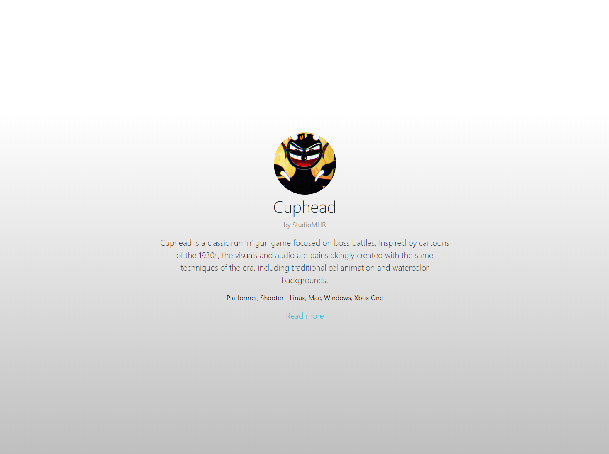

# Go Web App
Web app written in Go for a Unity3D interview programming challenge. The app follows an MVC pattern and features a simple templating engine. The MVC is implemented with a small set of library functions including ones to display and cache views (templates), and ones to create routes. Another component in the library is a session manager which is used to store the state of the users of the app.

## Functionality
The purpose of this app to to display game titles from Unity3D's showcase page. With the rules that a different game is shown every time the page is refreshed, and no game should be repated until all titles have been seen.

## Outside Dependencies
Two outside projects are dependencies for this project
* goquery - this library is used to parse the data from the Unity3D gallery
* Bootstrap - this toolkit is used as the framework to display the web app

## Running the App
Install the qoquery dependency by running this command
```
$ go get github.com/PuerkitoBio/goquery
```
Navigate to the root folder of the project, then run this command to start the web app on port 8080
```
$ go run webapp.go
```

## Preview
The app displays like this on desktop.
